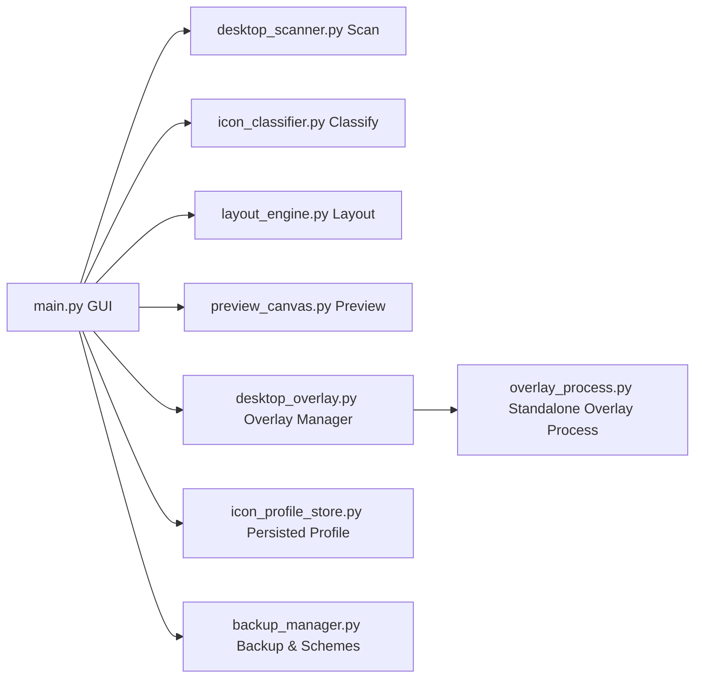

<div align="center">

# Desktop Icon Organizer

**Smart desktop icon organizer — classify, preview, arrange, and remember your preferences**

[](#)
[](#)
[](LICENSE)
[](#recent-updates)

中文文档: [README.md](README.md)

</div>

---

## Why Desktop Icon Organizer

Most desktop organizers rearrange icons once and forget everything. This tool **learns from you**:

- Auto-classify desktop icons using keywords, file extensions, and online lookup
- **Manual corrections are remembered** and prioritized in future classifications
- Preview and drag-swap icons before applying to your real desktop
- Overlay borders rendered in a standalone process, auto-restore on reboot

---

## Features

<table>
<tr>
<td width="50%">

**Scan & Classify**
- Deep scan via Win32 ListView API
- 14 preset categories (Browser, Office, Dev, Games…)
- 3-level classification: keywords + extensions + online search
- Manual overrides persist forever with highest priority

</td>
<td width="50%">

**Layout & Preview**
- Vertical partition grid layout, no overlapping
- Real-time canvas preview with drag-to-swap
- Zoom control (50% – 200%)
- One-click apply to real desktop

</td>
</tr>
<tr>
<td>

**Overlay Borders**
- Standalone process, survives main app exit
- 4 border styles: rounded / square / corner / bracket
- Embedded in desktop window layer, won't cover other apps
- Auto-start on boot, restores overlay and icon positions

</td>
<td>

**Backup & Schemes**
- One-click backup of current desktop layout
- Save/load multiple layout schemes
- Persistent layout: auto-restore on boot
- Full backup management (view / delete)

</td>
</tr>
</table>

---

## Screenshots


<details>
<summary>More screenshots</summary>

- [Original Desktop](screenshots/1.png)
- [Layout Preview](screenshots/3.png)
- [Apply Layout](screenshots/4.png)
- [Overlay Border](screenshots/5.png)

</details>

---

## Quick Start

### Option A: Download EXE (Recommended)

Go to [Releases](https://github.com/sakura-love/desktop-icon-organizer-master/releases) and download the latest version. Double-click to run.

### Option B: Run from Source

```bash
git clone https://github.com/sakura-love/desktop-icon-organizer-master.git
cd desktop-icon-organizer-master
pip install -r requirements.txt
python main.py
```

### Option C: Build Your Own

```bash
pip install pyinstaller
python -m PyInstaller --clean --noconfirm build.spec
```

Output: `dist/DesktopIconOrganizer_v2.5.exe`

---

## Workflow

```
Scan → Auto/Online Classify → Preview & Adjust → Manual Fix (remembered) → Show Borders → Apply
```

1. **Scan Desktop** — detect all icons automatically
2. **Auto Classify** — fast local rules, or use **Online Classify** for better accuracy
3. **Preview** — drag icons to swap positions on the canvas
4. **Manual Fix** — adjust categories in the right panel (persisted for next time)
5. **Show Borders** — overlay category region borders on your desktop
6. **Apply Layout** — one-click apply the preview to your real desktop
7. **Persist** — save layout schemes / enable auto-restore on boot

---

## Tech Stack

| Component | Technology |
|---|---|
| GUI | CustomTkinter (Windows 11 dark theme) |
| Desktop Interaction | Win32 API via ctypes — ListView messages, cross-process memory R/W |
| Icon Extraction | SHGetFileInfo + HICON to PIL Image |
| Overlay | Standalone process + layered window (UpdateLayeredWindow) |
| Classification | Local keyword database + DuckDuckGo Instant Answer API |
| Packaging | PyInstaller single-file EXE |

---

## Architecture



---

## Project Structure

```text
desktop-icon-organizer-master/
├── main.py                   # Main GUI application
├── desktop_scanner.py        # Win32 desktop icon scan & position control
├── icon_classifier.py        # Classification engine (keywords + extensions + online)
├── icon_profile_store.py     # Icon profile & manual category persistence
├── layout_engine.py          # Grid layout calculation
├── preview_canvas.py         # Drag-and-swap preview canvas
├── desktop_overlay.py        # Overlay manager, renderer, auto-start
├── overlay_process.py        # Standalone overlay process (Win32 layered window)
├── backup_manager.py         # Backup & layout scheme management
├── build.spec                # PyInstaller build config
├── build.bat                 # One-click build script
├── requirements.txt          # Python dependencies
├── app.ico                   # Application icon
├── PingFang SC.ttf           # Bundled font (overlay label rendering)
├── screenshots/              # README screenshots
├── backups/                  # Backup directory
└── layouts/                  # Layout schemes directory
```

---

## Key Data Files

| File | Description |
|---|---|
| `icon_profile.json` | Icon scan info + manual category preferences (auto-generated) |
| `layouts/*.json` | Saved layout schemes |
| `backups/*.json` | Desktop position backup snapshots |
| `overlay_layout_persistent.json` | Persistent overlay layout (for auto-start) |

---

## Recent Updates

### v2.5 (2026-04-29)

- Fixed overlay window not displaying (UpdateLayeredWindow render call was missing)
- Fixed overlay Z-order management, correctly embedded in desktop window layer
- Fixed preview canvas icon images disappearing due to GC
- Fixed UI freeze when loading layout (now async)
- Fixed error dialog showing meaningless traceback
- Removed unreachable code and redundant initializations

### v2.0 (2026-04-25)

- Added icon profile persistence: manual category overrides remembered across sessions
- Added 4 border styles (rounded / square / corner / bracket)
- Single-instance overlay management with auto-cleanup
- Compatible with source mode and PyInstaller packaged mode

---

## FAQ

<details>
<summary><b>Q: Border doesn't update</b></summary>

Click "Hide Border", then "Show Border" to re-render.
</details>

<details>
<summary><b>Q: Why run as Administrator?</b></summary>

Desktop icon positioning relies on SendMessage to explorer.exe's ListView. Admin mode improves stability.
</details>

<details>
<summary><b>Q: How does auto-start work?</b></summary>

Adds a registry entry under `HKCU\Software\Microsoft\Windows\CurrentVersion\Run` that launches the overlay process with `--autostart`, reading the persistent layout file to restore.
</details>

<details>
<summary><b>Q: What API does online classification use?</b></summary>

DuckDuckGo Instant Answer API — no API key required, no user data collected.
</details>

---

## Contributing

Issues and PRs are welcome!

1. Fork this repository
2. Create a feature branch (`git checkout -b feature/xxx`)
3. Commit your changes (`git commit -m 'Add xxx'`)
4. Push to the branch (`git push origin feature/xxx`)
5. Open a Pull Request

---

## License

MIT License. See [LICENSE](LICENSE).
