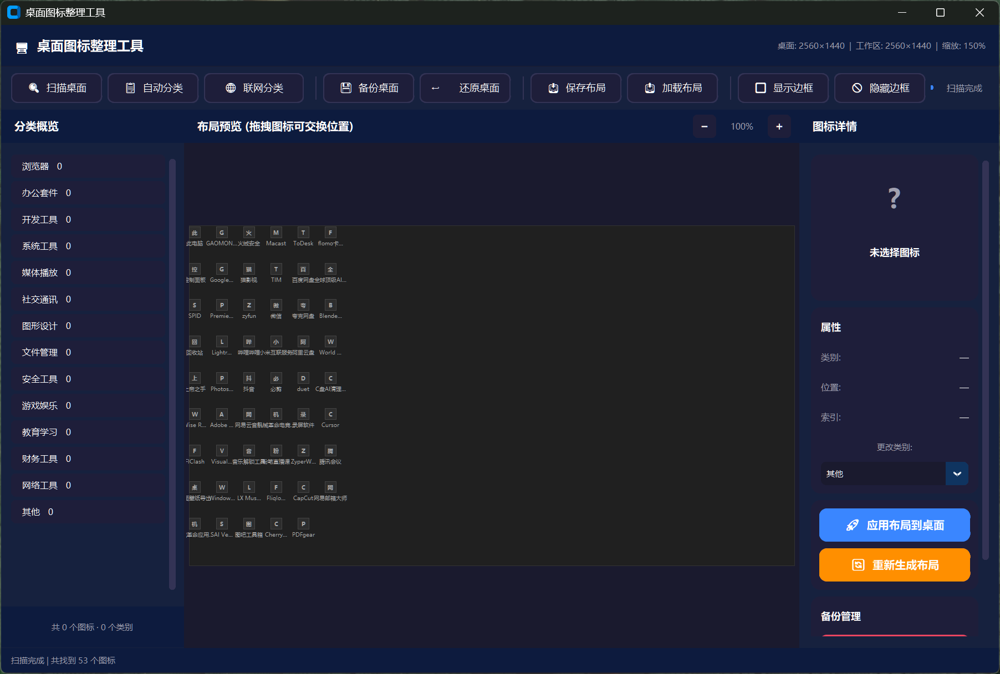
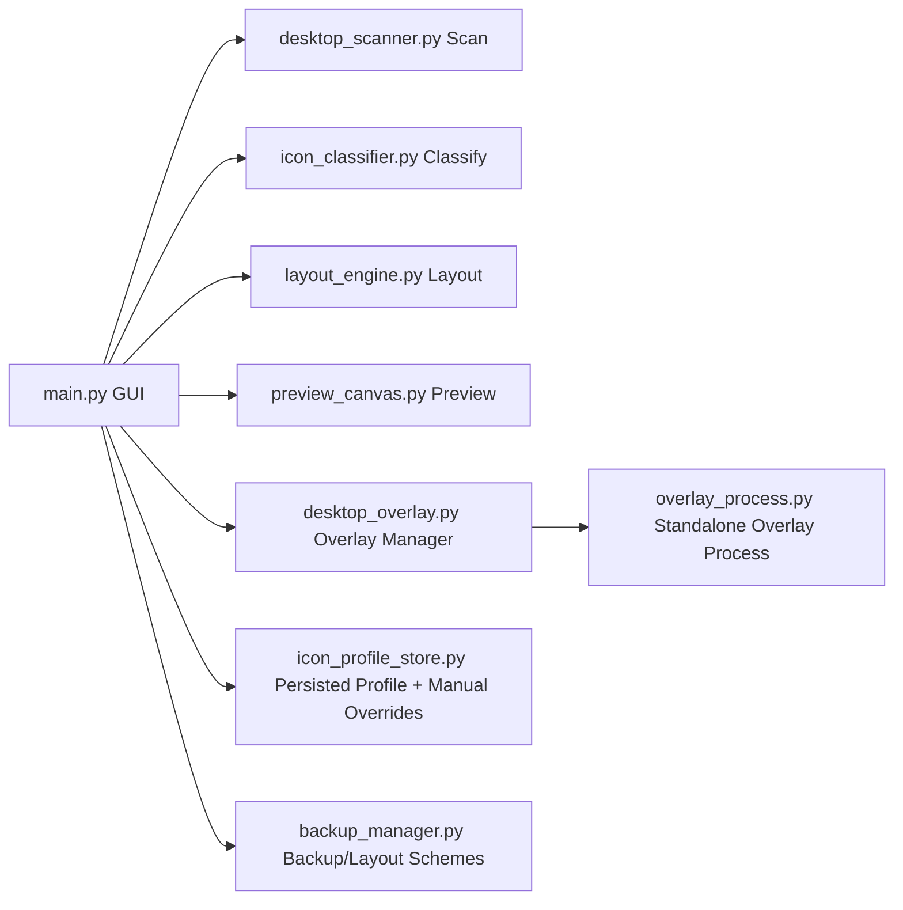

<div align="center">

# Desktop Icon Organizer

**Turn a messy Windows desktop into a maintainable categorized layout in minutes.**

[](#)
[](#)
[](LICENSE)
[](#recent-updates)

中文文档: [README.md](README.md)

</div>

---

## Why This Project

Most desktop organizers can rearrange icons once, but they do not learn your preferences.

This project is designed to:
- auto-classify desktop icons
- persist your manual category adjustments
- keep future reorganizations aligned with your own rules

---

## Features

| Feature | Description |
|---|---|
| Desktop scan | Uses Win32 ListView APIs to read icons, positions, and target paths |
| Auto classification | Keyword + extension based classification |
| Online classification | Optional online fallback when local rules are uncertain |
| Manual-first behavior | Persisted manual category overrides are prioritized next time |
| Visual preview | Drag-and-swap layout adjustments before apply |
| Overlay border | Category border rendering in a standalone process |
| Layout management | Backup, restore, save layout, load layout |

---

## Screenshots



More screenshots:
- [Original Desktop](screenshots/1.png)
- [Layout Preview](screenshots/3.png)
- [Apply Layout](screenshots/4.png)
- [Overlay Border](screenshots/5.png)

---

## Quick Start

### A) Run from source

```bash
git clone https://github.com/sakura-love/desktop-icon-organizer-master.git
cd desktop-icon-organizer-master
pip install -r requirements.txt
python main.py
```

### B) Build executable

```bash
pip install pyinstaller
python -m PyInstaller --clean --noconfirm build.spec
```

Output:
- `dist/DesktopIconOrganizer_v2.0.exe`

---

## Typical Workflow

1. Scan desktop icons
2. Run auto classification or online classification
3. Review and fine-tune with drag-and-swap preview
4. Manually adjust specific categories (persisted)
5. Select border style and show overlay
6. Apply layout to desktop
7. Save persistent layout/backups if needed

---

## Recent Updates

### v2.0 (2026-04-25)
- Added persistent icon profile file: `icon_profile.json`
- Persist category and layout position for each icon
- Persist manual category edits and prioritize them in future auto/online classification
- Added overlay border styles:
  - `rounded`
  - `square`
  - `corner`
  - `bracket`
- Border style selector now displays Chinese labels in UI
- Fixed overlay duplication and multi-process issues:
  - enforce single-instance overlay behavior
  - detect both source mode (`overlay_process.py`) and packaged mode (`--overlay`)
  - clean stale duplicate overlay processes automatically
- Updated build output name to: `DesktopIconOrganizer_v2.0.exe`

---

## Architecture



---

## Key Data Files

- `icon_profile.json`: icon scan info + manual category overrides
- `layouts/*.json`: saved layout schemes
- `backups/*.json`: backup snapshots
- `overlay_layout_persistent.json`: persistent overlay layout state

---

## FAQ

### Overlay did not refresh as expected
Click “Hide Border” and then “Show Border” again.

### Why run as Administrator
Desktop icon positioning relies on system window messaging; admin mode improves stability.

### How overlay starts in packaged mode
Overlay subprocess is started with `--overlay`.

---

## Project Structure

```text
desktop-icon-organizer-master/
├── main.py
├── desktop_scanner.py
├── icon_classifier.py
├── icon_profile_store.py
├── layout_engine.py
├── preview_canvas.py
├── desktop_overlay.py
├── overlay_process.py
├── backup_manager.py
├── build.spec
├── build.bat
├── requirements.txt
├── screenshots/
├── backups/
└── layouts/
```

---

## Contributing

Issues and PRs are welcome.

---

## License

MIT License. See [LICENSE](LICENSE).
