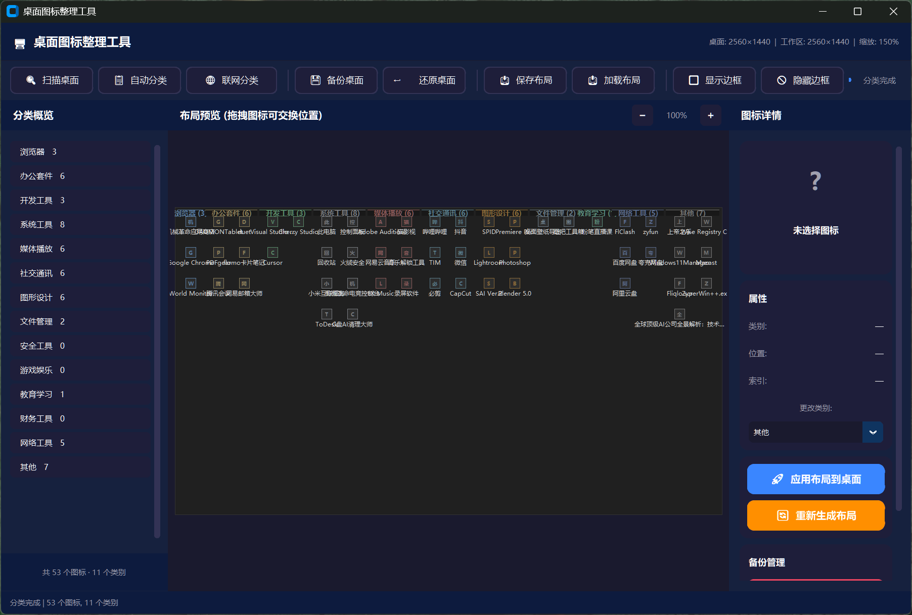

[English README](README.en.md)

# Desktop Icon Organizer（桌面图标整理工具）

一款用于 Windows 的桌面图标整理工具，支持桌面图标扫描、自动/联网分类、可视化布局预览、边框叠加显示、备份/还原和一键应用。

## 功能亮点
- 基于 Win32 ListView API 的桌面图标扫描。
- 自动分类（关键词 + 扩展名）与联网分类补充。
- 可视化布局预览，支持拖拽交换图标位置。
- 分类边框叠加层（独立进程渲染）。
- 支持备份、还原、保存布局、加载布局。
- 支持持久化布局与开机恢复。

## 最近更新

### v2.0（2026-04-25）
- 新增图标配置持久化文件：`icon_profile.json`。
- 分类完成后可持久化每个图标的分类与布局位置。
- 手动修改图标分类后会持久化保存，并在后续自动分类/联网分类中优先使用。
- 新增边框样式：
  - `rounded`（圆角）
  - `square`（直角）
  - `corner`（角标）
  - `bracket`（括号）
- 边框样式在 UI 中支持中文标签显示。
- 修复边框样式切换可能导致叠加层重复叠加、后台多进程的问题：
  - 叠加层按单实例管理
  - 同时兼容源码模式（`overlay_process.py`）和打包模式（`--overlay`）
  - 自动清理重复/残留叠加层进程
- 打包输出名称更新为：`DesktopIconOrganizer_v2.0.exe`。

### 上一补丁（2026-04-13）
- 优化打包版临时目录清理稳定性。
- 优化叠加层子进程启动环境隔离。

## 界面截图





## 运行要求
- Windows 10/11
- Python 3.9+
- 建议管理员权限运行（提升桌面图标操作稳定性）

## 快速开始

### 方式 A：源码运行
```bash
git clone https://github.com/sakura-love/desktop-icon-organizer-master.git
cd desktop-icon-organizer-master
pip install -r requirements.txt
python main.py
```

### 方式 B：打包 EXE
```bash
pip install pyinstaller
python -m PyInstaller --clean --noconfirm build.spec
```
输出文件：
- `dist/DesktopIconOrganizer_v2.0.exe`

## 推荐使用流程
1. 扫描桌面图标。
2. 执行自动分类或联网分类。
3. 在预览区检查并按需拖拽调整。
4. 对个别图标手动改分类（会被记忆并优先使用）。
5. 选择边框样式并显示边框。
6. 一键应用布局到桌面。
7. 按需保存持久化布局或备份。

## 项目结构
```text
desktop-icon-organizer-master/
├── main.py                   # 主 GUI 程序
├── desktop_scanner.py        # 扫描/应用图标位置
├── icon_classifier.py        # 分类引擎
├── icon_profile_store.py     # 图标配置与手动分类偏好持久化
├── layout_engine.py          # 布局计算
├── preview_canvas.py         # 预览画布
├── desktop_overlay.py        # 叠加层管理与渲染
├── overlay_process.py        # 叠加层独立进程
├── backup_manager.py         # 备份与布局管理
├── build.spec                # PyInstaller 配置
├── build.bat                 # 打包脚本
├── requirements.txt          # 依赖
├── screenshots/              # README 截图
├── backups/                  # 备份目录
└── layouts/                  # 布局方案目录
```

## 说明
- 打包模式下叠加层通过 `--overlay` 运行。
- 若边框显示异常，可先“隐藏边框”再“显示边框”。
- 仓库中可能包含本地构建产物：`build/`、`dist/`、`__pycache__/`。

## 许可证
MIT License，详见 [LICENSE](LICENSE)。

