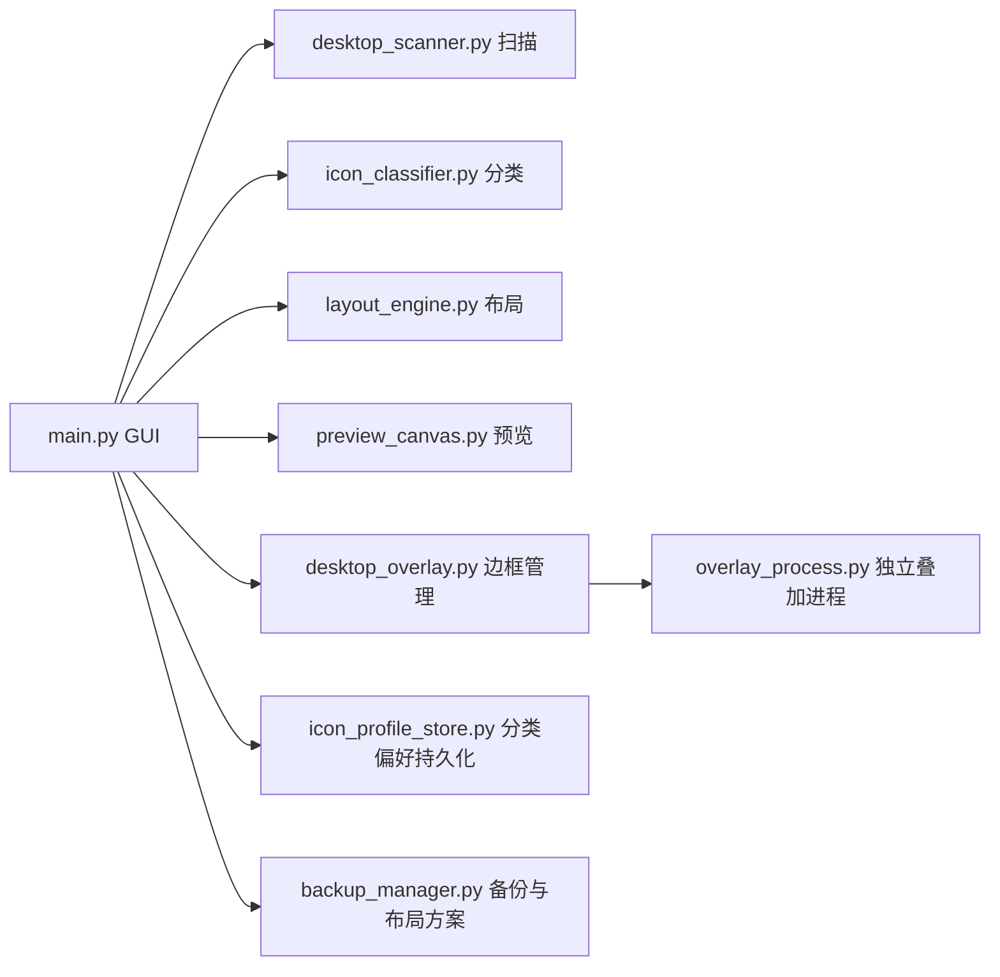

<div align="center">

# Desktop Icon Organizer

**智能桌面图标整理工具 — 分类、预览、一键排列、持久记忆**

[](#)
[](#)
[](LICENSE)
[](#最近更新)

English: [README.en.md](README.en.md)

</div>

---

## 为什么选择这个工具

市面上的桌面整理工具大多只能"排一次就完事"，下次新增图标又要手动重来。

Desktop Icon Organizer 的核心理念是**越用越懂你**：

- 自动分类桌面图标（关键词 + 扩展名 + 联网识别）
- **手动修改会被记住**，下次整理自动应用你的偏好
- 分类前可预览、可拖拽调整，确认后再应用到桌面
- 独立进程渲染分类边框，重启后自动恢复布局

---

## 功能一览

<table>
<tr>
<td width="50%">

**扫描与分类**
- 基于 Win32 ListView API 深度扫描桌面
- 14 个预设类别（浏览器、办公、开发、游戏…）
- 关键词匹配 + 文件扩展名 + 联网搜索三级分类
- 手动修改的分类永久记忆，优先级最高

</td>
<td width="50%">

**布局与预览**
- 竖向分区网格布局，图标互不重叠
- 实时预览画布，支持拖拽交换位置
- 缩放查看（50% ~ 200%）
- 一键应用布局到真实桌面

</td>
</tr>
<tr>
<td>

**边框叠加层**
- 独立进程渲染，主程序退出后仍保持
- 4 种边框样式：圆角 / 直角 / 角标 / 括号
- 嵌入桌面窗口层级，不遮挡其他应用
- 开机自启动，自动恢复叠加层和图标位置

</td>
<td>

**备份与方案管理**
- 一键备份当前桌面布局
- 多方案保存/加载，随时切换不同布局
- 持久化布局：开机后自动恢复
- 完整的备份列表管理（查看/删除）

</td>
</tr>
</table>

---

## 界面预览


<details>
<summary>更多截图</summary>

- [原始桌面](screenshots/1.png)
- [布局预览](screenshots/3.png)
- [应用布局](screenshots/4.png)
- [边框叠加层](screenshots/5.png)

</details>

---

## 快速开始

### 方式 A：下载 EXE（推荐）

前往 [Releases](https://github.com/sakura-love/desktop-icon-organizer-master/releases) 下载最新版本，双击运行即可。

### 方式 B：从源码运行

```bash
git clone https://github.com/sakura-love/desktop-icon-organizer-master.git
cd desktop-icon-organizer-master
pip install -r requirements.txt
python main.py
```

### 方式 C：自行打包

```bash
pip install pyinstaller
python -m PyInstaller --clean --noconfirm build.spec
```

输出文件：`dist/DesktopIconOrganizer_v2.5.exe`

---

## 使用流程

```
扫描桌面 → 自动/联网分类 → 预览微调 → 手动修正（会被记住）→ 显示边框 → 应用布局
```

1. **扫描桌面** — 自动获取所有图标信息
2. **自动分类** — 本地规则快速分类；或使用**联网分类**获取更准确的结果
3. **预览调整** — 在画布中拖拽交换图标位置
4. **手动修正** — 右侧面板修改个别图标的分类（下次自动应用）
5. **显示边框** — 在桌面上叠加分类区域边框
6. **应用布局** — 一键将预览布局应用到真实桌面
7. **持久化** — 保存布局方案 / 开机自启动恢复

---

## 技术栈

| 组件 | 技术 |
|---|---|
| GUI | CustomTkinter (Windows 11 风格暗色主题) |
| 桌面交互 | Win32 API (ctypes) — ListView 消息、跨进程内存读写 |
| 图标提取 | SHGetFileInfo + HICON 转 PIL Image |
| 叠加层 | 独立进程 + 分层窗口 (UpdateLayeredWindow) |
| 分类引擎 | 本地关键词库 + DuckDuckGo Instant Answer API |
| 打包 | PyInstaller 单文件 EXE |

---

## 架构概览



---

## 项目结构

```text
desktop-icon-organizer-master/
├── main.py                   # 主 GUI 程序
├── desktop_scanner.py        # Win32 桌面图标扫描与位置操作
├── icon_classifier.py        # 分类引擎（关键词 + 扩展名 + 联网）
├── icon_profile_store.py     # 图标配置与手动分类偏好持久化
├── layout_engine.py          # 网格布局计算
├── preview_canvas.py         # 拖拽预览画布
├── desktop_overlay.py        # 叠加层管理、渲染、开机自启
├── overlay_process.py        # 叠加层独立进程（Win32 分层窗口）
├── backup_manager.py         # 备份与布局方案管理
├── build.spec                # PyInstaller 打包配置
├── build.bat                 # 一键打包脚本
├── requirements.txt          # Python 依赖
├── app.ico                   # 应用图标
├── PingFang SC.ttf           # 内置字体（叠加层标签渲染）
├── screenshots/              # README 截图
├── backups/                  # 备份目录
└── layouts/                  # 布局方案目录
```

---

## 关键数据文件

| 文件 | 说明 |
|---|---|
| `icon_profile.json` | 图标扫描信息 + 手动分类偏好（自动生成） |
| `layouts/*.json` | 保存的布局方案 |
| `backups/*.json` | 桌面位置备份快照 |
| `overlay_layout_persistent.json` | 持久化叠加层布局（开机自启用） |

---

## 最近更新

### v2.5（2026-04-29）

- 修复叠加层窗口不显示的问题（UpdateLayeredWindow 渲染丢失）
- 修复叠加层 Z-order 管理，正确嵌入桌面窗口层级
- 修复预览画布图标图像 GC 回收导致不显示
- 修复加载布局时界面卡死（改为异步回调）
- 修复错误弹窗显示无意义 traceback
- 移除不可达代码和冗余初始化

### v2.0（2026-04-25）

- 新增图标配置持久化：手动修改的分类会被记住并在后续优先使用
- 新增 4 种边框样式（圆角 / 直角 / 角标 / 括号）
- 叠加层单实例管理，自动清理残留进程
- 兼容源码模式与 PyInstaller 打包模式

---

## 常见问题

<details>
<summary><b>Q: 边框看起来没更新</b></summary>

先点击"隐藏边框"，再点击"显示边框"重新渲染。
</details>

<details>
<summary><b>Q: 为什么建议管理员权限运行</b></summary>

桌面图标位置操作依赖系统窗口消息（SendMessage 到 explorer.exe 的 ListView），管理员权限下稳定性更高。
</details>

<details>
<summary><b>Q: 叠加层开机自启是怎么实现的</b></summary>

在注册表 `HKCU\Software\Microsoft\Windows\CurrentVersion\Run` 中添加启动项，以 `--autostart` 参数启动叠加层独立进程，读取持久化布局文件恢复。
</details>

<details>
<summary><b>Q: 联网分类用的什么 API</b></summary>

使用 DuckDuckGo Instant Answer API，无需 API Key，不记录用户数据。
</details>

---

## 贡献

欢迎 Issue / PR！

1. Fork 本仓库
2. 创建特性分支 (`git checkout -b feature/xxx`)
3. 提交改动 (`git commit -m 'Add xxx'`)
4. 推送分支 (`git push origin feature/xxx`)
5. 发起 Pull Request

---

## 许可证

MIT License，详见 [LICENSE](LICENSE)。
