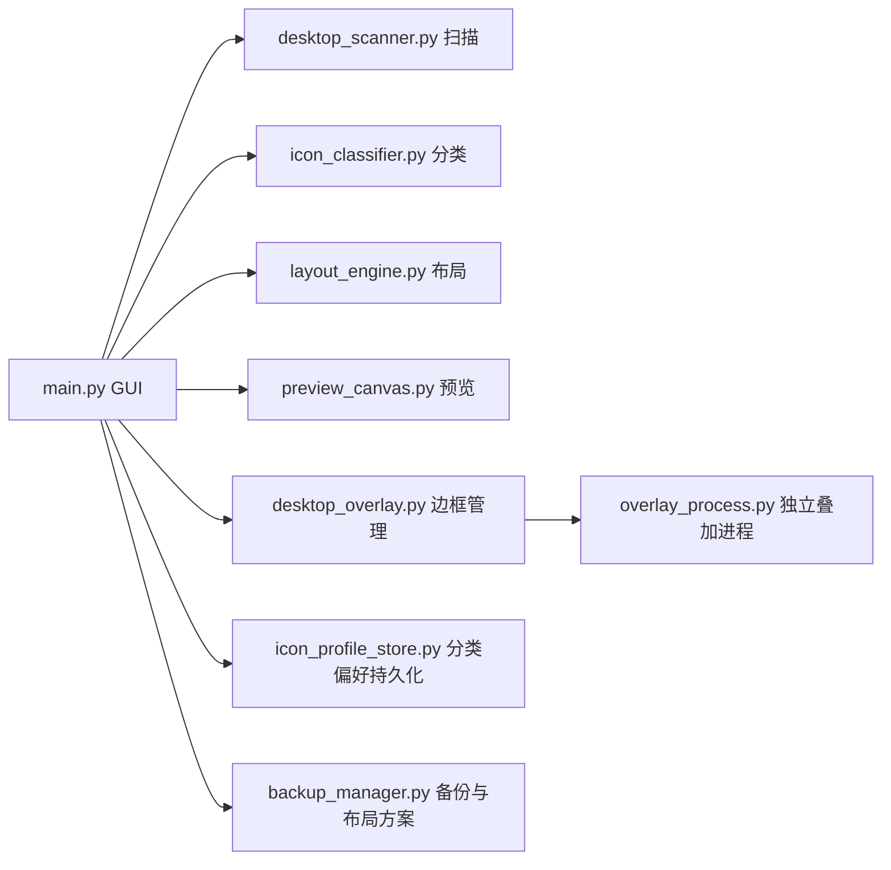

> 本文件为中文镜像，GitHub 首页默认使用 [README.md](README.md)。
>
> English: [README.en.md](README.en.md)

---

<div align="center">

# Desktop Icon Organizer

**让凌乱桌面在 1 分钟内变成可维护的分类布局**

[](#)
[](#)
[](LICENSE)
[](#最近更新)

English: [README.en.md](README.en.md)

</div>

---

## 为什么这个项目值得用

很多桌面整理工具只能“排一次”，下次新增图标又要重来。

这个项目的核心目标是：
- 不止自动分类
- 还能记住你的人工修正
- 让后续每次整理都越来越符合你的习惯

---

## 核心能力

| 能力 | 说明 |
|---|---|
| 桌面扫描 | 基于 Win32 ListView API 获取图标、位置、目标路径 |
| 自动分类 | 关键词 + 扩展名规则分类 |
| 联网分类 | 自动规则不确定时可联网补充判断 |
| 人工优先 | 手动修改过的分类会持久化并在下次优先使用 |
| 可视化预览 | 拖拽交换图标位置，应用前可确认效果 |
| 边框叠加层 | 独立进程渲染分类边框，支持多样式 |
| 布局管理 | 备份、还原、保存方案、加载方案 |

---

## 界面预览


更多截图：
- [原始桌面](screenshots/1.png)
- [布局预览](screenshots/3.png)
- [应用布局](screenshots/4.png)
- [边框叠加层](screenshots/5.png)

---

## 快速开始

### 方式 A：直接运行源码

```bash
git clone https://github.com/sakura-love/desktop-icon-organizer-master.git
cd desktop-icon-organizer-master
pip install -r requirements.txt
python main.py
```

### 方式 B：打包 EXE

```bash
pip install pyinstaller
python -m PyInstaller --clean --noconfirm build.spec
```

输出文件：
- `dist/DesktopIconOrganizer_v2.0.exe`

---

## 推荐使用流程

1. 扫描桌面图标
2. 自动分类或联网分类
3. 在预览区拖拽微调
4. 对个别图标手动改分类（会被记忆）
5. 选择边框样式并显示边框
6. 一键应用布局到桌面
7. 需要时保存持久化布局/备份

---

## 最近更新

### v2.0（2026-04-25）

- 新增图标配置持久化文件：`icon_profile.json`
- 分类结果可持久化每个图标的分类和布局位置
- 手动修改分类会被保存，并在后续自动/联网分类中优先使用
- 新增边框样式：
  - `rounded`（圆角）
  - `square`（直角）
  - `corner`（角标）
  - `bracket`（括号）
- 样式选择器支持中文标签显示
- 修复边框样式切换导致叠加层重复、多进程残留的问题：
  - 叠加层单实例管理
  - 兼容源码模式（`overlay_process.py`）与打包模式（`--overlay`）
  - 自动清理重复/残留叠加进程
- 打包输出名更新为：`DesktopIconOrganizer_v2.0.exe`

---

## 架构概览



---

## 关键配置文件

- `icon_profile.json`：图标扫描信息 + 手动分类偏好
- `layouts/*.json`：保存的布局方案
- `backups/*.json`：桌面位置备份
- `overlay_layout_persistent.json`：持久化叠加层布局

---

## 常见问题

### 1) 边框看起来没更新
先点击“隐藏边框”，再点击“显示边框”。

### 2) 为什么建议管理员权限运行
桌面图标位置操作依赖系统窗口消息，管理员权限下稳定性更高。

### 3) 打包后叠加层如何启动
打包模式通过 `--overlay` 启动独立叠加层进程。

---

## 项目结构

```text
desktop-icon-organizer-master/
├── main.py                   # 主 GUI 程序
├── desktop_scanner.py        # 扫描/应用图标位置
├── icon_classifier.py        # 分类引擎
├── icon_profile_store.py     # 图标配置与手动分类偏好持久化
├── layout_engine.py          # 布局计算
├── preview_canvas.py         # 预览画布
├── desktop_overlay.py        # 叠加层管理与渲染
├── overlay_process.py        # 叠加层独立进程
├── backup_manager.py         # 备份与布局管理
├── build.spec                # PyInstaller 配置
├── build.bat                 # 打包脚本
├── requirements.txt          # 依赖
├── screenshots/              # README 截图
├── backups/                  # 备份目录
└── layouts/                  # 布局方案目录
```

---

## 贡献

欢迎 Issue / PR。

建议流程：
1. Fork 仓库并创建分支
2. 提交改动与说明
3. 发起 Pull Request

---

## 许可证

MIT License，详见 [LICENSE](LICENSE)。
